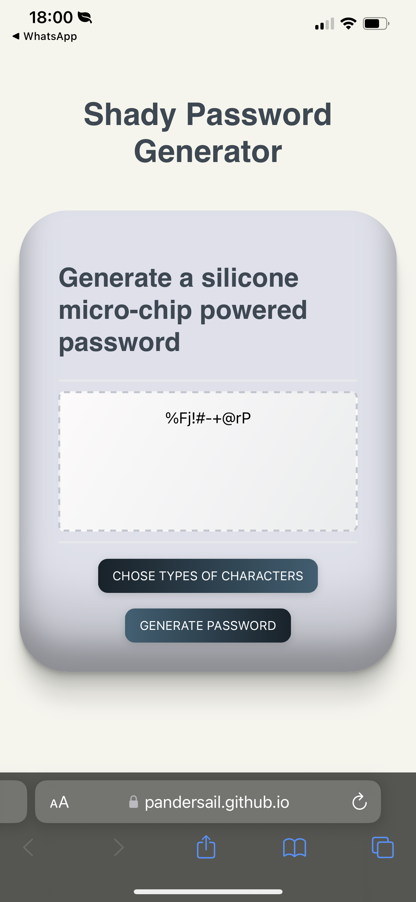
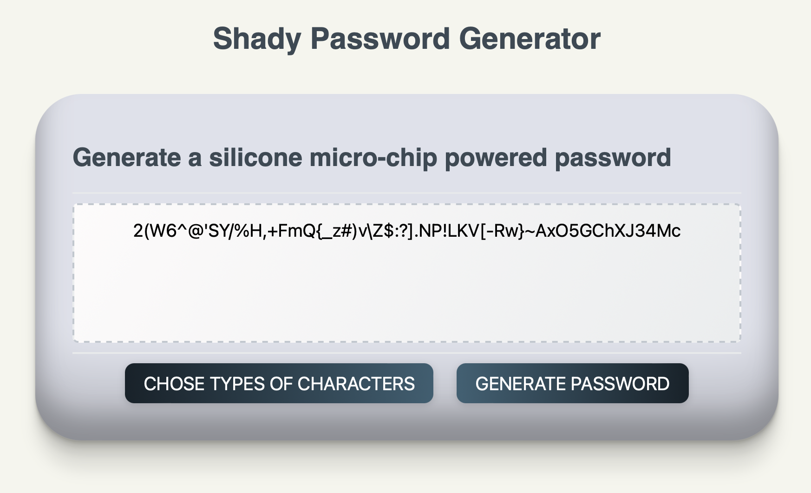
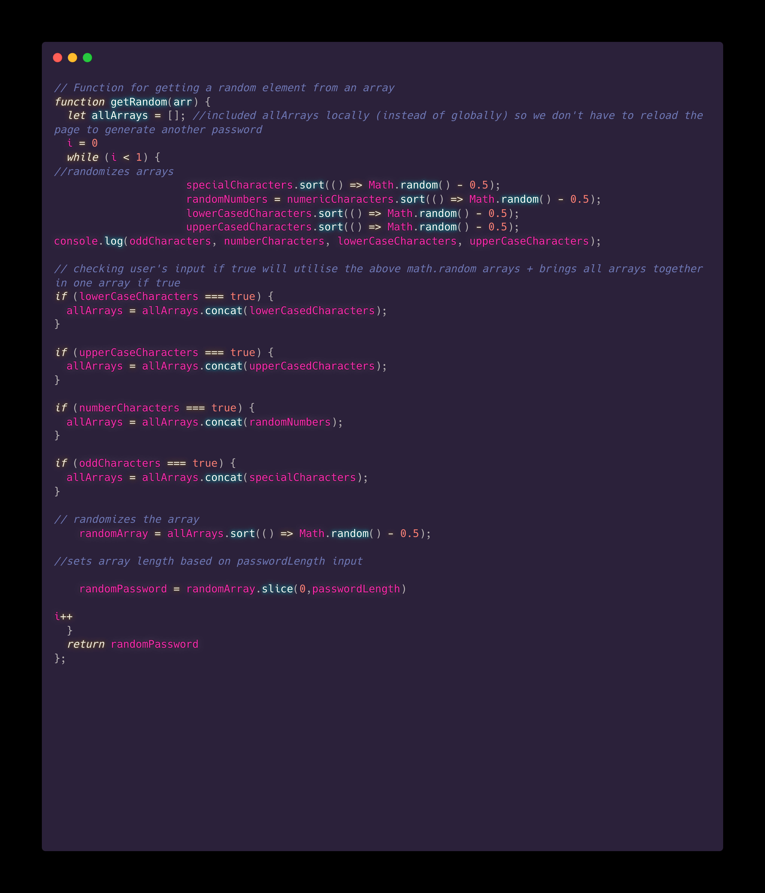

# Password Generator

This code defines four arrays of characters (special, numeric, lowercase, and uppercase) that can be included in a password. It then declares several variables, including flags for whether each character set should be included in the password, and a variable to store the desired password length. The code includes a function "getPasswordOptions" that prompts the user to input the desired password length and confirm whether they want to include each character set in their password. If the user inputs an invalid password length or chooses not to include any character sets, the code will break and display an alert asking the user to reload the page.

The code also includes a function "getRandom" that takes an array as an input and returns a randomly selected element from that array. This function is intended to be used later in the code to randomly select characters from the character sets specified by the user to generate the password.

## Features

- It allows users to generate a strong and secure password by including a variety of character types (special characters, numeric characters, lowercase characters, and uppercase characters).

- It prompts the user to specify the desired length of their password, which can help ensure the password is long enough to be considered secure.

- It allows the user to choose which types of characters they want to include in the password, which can help them create a password that is personalized to their preferences.

- It includes validation to ensure that the user inputs a valid password length and that they choose at least one type of character to make-up the password.

- The code uses a function to randomly select characters from the specified character sets, which can help ensure that the generated passwords are truly random and therefore harder to guess.

- It has an alert message to welcome the user and provide information about the application.

- It makes it easy for the user to generate a password without any specific technical knowledge.

## Application

Mobile

Desktop

Visit the password generator [here.](https://pandersail.github.io/password-generator/) 

Visit the password generator repository [here.](https://github.com/pandersail/password-generator)

## Importancy

You can read on why it is critical to have strong and safe passwords [here.](https://www.securedatarecovery.com/resources/the-importance-of-strong-secure-passwords)

## 🔗 Links

[GitHub](https://github.com/pandersail)

[linkedin](https://www.linkedin.com/in/angeloantosilva/)

[twitter](https://twitter.com/pandersail)

## Snippet

Code snippet.

## Acknowledgements

A big thank you to Armando Osorio for helping me solve a bug where all the arrays would alwyas be taken into account despite user's input.

## Feedback

If you have any feedback, please reach out to me at papayas-stamper-0z@icloud.com.

## License

Copyright (c) Angelo Silva. All rights reserved

[MIT](https://choosealicense.com/licenses/mit/)

